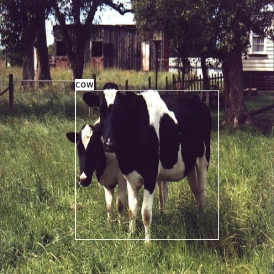

# ONNC WebAssembly Backend

Implement an ONNC Backend that can compile ONNX model to WebAssembly module and run on WebAssembly platform.

## Prerequisites

* git
* docker

## Quick start

### Clone wasm-backend

```shell
# Clone ONNC-Wasm
git clone https://github.com/ONNC/onnc-wasm.git
cd onnc-wasm
# Setup SSVM
git submodule add https://github.com/second-state/SSVM ssvm
cd ssvm && git checkout b5785ed6f8f24de2afa54ec6c28904e7607a0f12
cd ..
```

### Enter docker

```shell
./scripts/start_docker_env.sh
```

The start-up message will show some tips in tne console.

If you want to show the message again, type:

```shell
cat /etc/motd
```

Wasm-backend directory will be mounted as "/home/onnc/workspace". Files and directories are shared between host machine and docker container here.

### Get ONNX model

You can get ONNX models and related test data from these links

* AlexNet : https://s3.amazonaws.com/download.onnx/models/opset_7/bvlc_alexnet.tar.gz
* ResNet50 : https://s3.amazonaws.com/onnx-model-zoo/resnet/resnet50v2/resnet50v2.tar.gz
* GoogleNet : https://s3.amazonaws.com/download.onnx/models/opset_7/bvlc_googlenet.tar.gz
* CaffeNet : https://s3.amazonaws.com/download.onnx/models/opset_7/bvlc_reference_caffenet.tar.gz
* R-CNN ILSVRC13 : https://s3.amazonaws.com/download.onnx/models/opset_7/bvlc_reference_rcnn_ilsvrc13.tar.gz
* DenseNet-121 : https://s3.amazonaws.com/download.onnx/models/opset_7/densenet121.tar.gz
* Inception v1 : https://s3.amazonaws.com/download.onnx/models/opset_7/inception_v1.tar.gz
* Inception v2 : https://s3.amazonaws.com/download.onnx/models/opset_7/inception_v2.tar.gz
* ShuffleNet : https://s3.amazonaws.com/download.onnx/models/opset_7/shufflenet.tar.gz
* ZFNet-512 : https://s3.amazonaws.com/download.onnx/models/opset_7/zfnet512.tar.gz
* SqueezeNet : https://s3.amazonaws.com/onnx-model-zoo/squeezenet/squeezenet1.1/squeezenet1.1.tar.gz

Download these files and put into the `models` folder of wasm-backend. You can download either inside or outside docker container.

The links are referenced from ONNX model zoo

In this guide, we take AlexNet as example:

```shell
cd /home/onnc/workspace/models && wget https://s3.amazonaws.com/download.onnx/models/opset_7/bvlc_alexnet.tar.gz
```

2. Extract the tar file

```shell
cd /home/onnc/workspace/models && tar -zxvf bvlc_alexnet.tar.gz
```

3. Build ONNX model and ONNC runtime libraries

```shell
../scripts/build.sh ssvm bvlc_alexnet/model.onnx
```

4. Convert input Protobuf file to Tensor file

ONNX model zoo provides Protobuf files to test each model. We need to convert Protobuf into Tensor file by `pb2t` tool

```shell
../tools/pb2t bvlc_alexnet/test_data_set_0/input_0.pb bvlc_alexnet/test_data_set_0/input_0.tensor
```

5. Run model with input Tensor file

```shell
../scripts/run.sh ssvm out-ssvm model bvlc_alexnet/test_data_set_0/input_0.tensor output.data
```

The result will be `output.data` as raw binary data

6. [OPTIONAL] Convert output to human-readable format and check inference result 

```shell
python3 ../scripts/numpy2text.py output.data output.txt
cat output.txt
```

### Object detection with TinyYolo v1 model

We provide TinyYolo v1 model in the Docker image for object detection

1. Build ONNX model and ONNC runtime libraries

```shell
cd /home/onnc/workspace/models && ../scripts/build.sh ssvm /home/onnc/tiny_yolov1/model.onnx
```

2. Convert input JPEG file to Tensor file

You can use your JPEG image file with `jpg2t` tool to convert into Tensor file. It can also crop image to 448\*448 as TinyYolo v1 input

Take test image file as example

```shell
./out-ssvm/bin/jpg2t /home/onnc/tiny_yolov1/test_data_set_0/input_0.jpg input.tensor 448 448
```

3. Run model with input Tensor file

```shell
../scripts/run.sh ssvm out-ssvm/ model input.tensor output.data
```

The result will be `output.data` as raw binary data

4. Detect result and combined it with input image file into output image file

```shell
./out-ssvm/bin/detection output.data /home/onnc/tiny_yolov1/test_data_set_0/input_0.jpg output.jpg
```

Result:



## Advanced command

### Build ONNX model and related libraries

You have to prepare:

* An ONNX model file (.onnx)

```shell
./scripts/build.sh <mode> <onnx_file> [output_dir]
```

#### Arguments

* mode : Build mode
* onnx_file : Input file in ONNX format
* output_dir : **[Optional]** Where built files will be

#### Available modes

* native
    Build ONNX model and ONNC runtime library in native C environment.
* ssvm
    Build ONNX model and ONNC runtime library for SSVM in native environment.

#### Example

```shell
./scripts/build.sh native alexnet.onnx
```

### Run ONNX model

You have to prepare:

* An input file in protobuf format (.pb) or jpeg format (.jpg)
* Already finished [Build](#Build) step

#### 1-1. Convert protobuf input file to input tensor file

```shell
tools/pb2t <input_file>.pb <tensor_file>.tensor
```

#### 1-2. Convert jpeg input file to input tensor file

```shell
<output_dir>/jpg2t <input_file>.jpg <tensor_file>.tensor
```

#### 2. Execute `./scripts/run.sh` script

```shell
./scripts/run.sh <mode> <output_dir> <model_name> <tensor_file> [output_file]
```

##### Arguments

* mode : Run mode
* output_dir : Compiled model file (In native binary or wasm)
* model_name : Model name without .onnx suffix
* tensor_file : Input tensor file (In .tensor)
* [output_file] : [OPTIONAL] Where output file store

##### Available modes

* native
    Build ONNX model and ONNC runtime library in native C environment.
* ssvm
    Build ONNX model and ONNC runtime library for SSVM in native environment.

##### **NOTICE**

In SSVM mode, <tensor_file> should be inside working directory or its descendant directories

#### Example

```bash
./scripts/run.sh ssvm out-ssvm alexnet input.tensor
```

#### 3. [TinyYoloV1 only] Draw detection result to JPEG file

```shell
<output_dir>/bin/detection <result_file> <image_file> <output_file>
```

##### Arguments

* output_dir : Compiled model file (In native binary or wasm)
* result_file : The inference result file
* image_file : Original input JPEG file
* output_file : Output JPEG file

#### Example

```bash
./out-ssvm/bin/detection result.numpy input.jpg out.jpg
```

See [Wiki](https://github.com/ONNC/wasm-backend/wiki) for more informations

## Supporting operators

Opset: 7 (ONNX v1.3.0)

### Float type

* add
* averagepool
* batchnormalization
* concat
* conv
* gemm
* globalaveragepool
* lrn
* maxpool
* mul
* relu
* reshape
* softmax
* sum
* transpose
* unsqueeze

### Int8 type

* add
* batchnormalization
* conv
* maxpool
* mul
* relu
